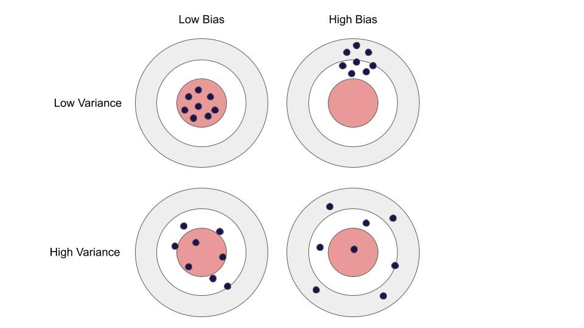
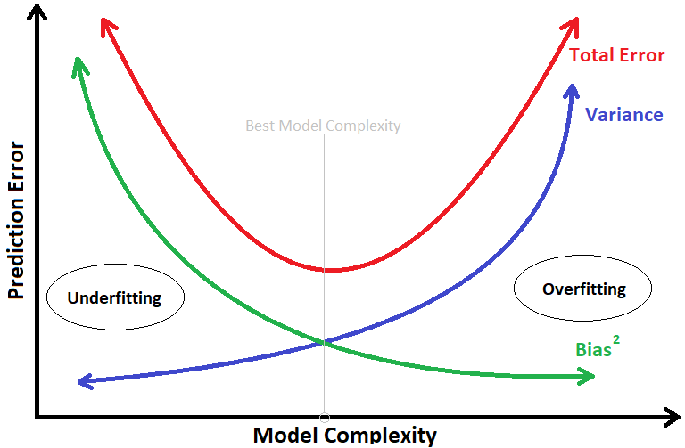

```{r setup, include=FALSE}
knitr::opts_chunk$set(echo = TRUE)
options(scipen = 8)
```


# Overview

Regression analysis is a way that can be used to determine the relationship between the predictor variable (x) and the target variable (y).

Ordinary Least Squares (OLS) is the most common estimation method for linear models and that is true for a good reason. As long as your model satisfies the OLS assumptions for linear regression, you can rest easy knowing that you are getting the best possible estimates. 

But in the real world to satisfy the assumptions of OLS regression will be very difficult.
If the OLS model you are using does not meet the assumptions, then the OLS estimator will have a very large variant, even though the OLS Estimator has the desired property that is not biased. However, the estimator which has a very large variant will produce a bad estimate.
Specifically, this happens when:

- The predictor variables are highly correlated with each other

- There are many predictors. This is reflected in the formula for variance given above: if m approaches n, the variance approaches infinity.

This graphic illustrates what bias and variance are. Imagine the bull's-eye is the true population parameter that we are estimating, β, and the shots at it are the values of our estimates resulting from four different estimators - low bias and variance, high bias and variance, and the combinations thereof.

{width=100%} 

Let’s say we have model which is very accurate, therefore the error of our model will be low, meaning a low bias and low variance as shown in first figure.  All the data points fit within the bulls-eye. 

Now how this bias and variance is balanced to have a perfect model? Take a look at the image below and try to understand.

{width=100%} 

In the picture above, it can be seen based on the complexity of the model that has 2 possible errors, namely:

1. Underfitting

2. Overfitting

To overcome **Underfitting** or high bias, we can basically add new parameters to our model so that the model complexity increases, and thus reducing high bias.

As a complexity model, which in the case of linear regression can be considered as the number of predictors, it increases, the expected variance also increases, but the bias decreases. An impartial OLS will place us on the right side of the image, which is far from optimal, this term is called **Overfitting**.

Now, how can we overcome Overfitting for a regression model?

Basically there are two methods to overcome overfitting,

**1. Reduce the model complexity**, 

To reduce the complexity of the model we can use stepwise Regression (forward or backward) selection for this, but that way we would not be able to tell anything about the removed variables' effect on the response.

But we will introduce you to 2 Regularization Regression methods that are quite good and can be used to overcome overfitting obstacles.

**2. Regularization.**

# Regularization

Regularization is a form of regression, which limits / regulates or shrinks the estimated coefficient towards zero. In other words, this technique does not encourage the learning of more complex or flexible models.

Minimizing the estimated coefficient done in this process is to add a bias parameter λ. So the variance will decrease.

There are two types of regression that are quite familiar and use this Regularization technique, namely:

1. Ridge Regression

2. Lasso Regression

# Ridge Regression

Ridge Regression is a variation of linear regression. We use ridge regression to tackle the multicollinearity problem. Due to multicollinearity, we see a very large variance in the least square estimates of the model. So to reduce this variance a degree of bais is added to the regression estimates.

Ordinary Least Square (OLS) will create a model by minimizing the value of Sum Square Error (SSE), Whereas The Rigde regression will create a model by minimizing :

SSE + λ (sum of the square of coefficients)

If λ = 0, the output is similar to simple linear regression.

If λ = very large , the coefficients will become zero.

# Lasso Regression

LASSO (Least Absolute Shrinkage Selector Operator), The algorithm is another variation of linear regression like ridge regression. We use lasso regression when we have large number of predictor variables.

The equation of lasso is similar to ridge regression and looks like as given below.

SSE + λ (sum of the absolute values of coefficients)
  
Here the objective is as follows: If λ = 0, We get same coefficients as linear regression If λ = vary large, All coefficients are shriked towards zero

**The main difference between Ridge and LASSO Regression is that if ridge regression can shrink the coefficient close to 0 so that all predictor variables are retained. Whereas LASSO can shrink the coefficient to exactly 0 so that LASSO can select and discard the predictor variables that have the right coefficient of 0.**


# Ordinary Least Square (OLS) Regression

## Libraries
```{r message=FALSE}
library(glmnet)  
library(dplyr)   
library(car)
library(nnet)
library(GGally)
library(lmtest)
```


## Read Data

```{r}
data(mtcars)
mtcars <- mtcars %>% 
  select(-vs, -am)
head(mtcars)
```

Now we will try to create an OLS model using `mtcars` data, which consists of 32 observations (rows) and 11 variables:

[, 1]	mpg	Miles/(US) gallon

[, 2]	cyl	Number of cylinders

[, 3]	disp	Displacement (cu.in.)

[, 4]	hp	Gross horsepower

[, 5]	drat	Rear axle ratio

[, 6]	wt	Weight (1000 lbs)

[, 7]	qsec	1/4 mile time

[, 8]	gear	Number of forward gears

[, 9]	carb	Number of carburetors

In this case, OLS Regression, Ridge Regression, and LASSO Regression will be applied to predict *mpg* based on 10 other predictor variables.

- Correlation 

```{r}
ggcorr(mtcars, label = T)
```

## Split Data for OLS model

```{r}
train <- head(mtcars,22)
test <- tail(mtcars,10)
```

## OLS Regression Model 
```{r}
ols <- lm(mpg~., train)
summary(ols)
```

## Assumption Checking of OLS Regression Model

Linear regression is an analysis that assesses whether one or more predictor variables explain the dependent (criterion) variable.  The regression has four key assumptions:

**1. Linearity**

linear regression needs the relationship between the predictor and target variables to be linear.  To test this linearity you can use the `cor.test ()` function.

- H0 : Correlation is not significant 

- H1 : Correlation is Significant

```{r}
cor.test(mtcars$mpg,mtcars$cyl)[[3]]
cor.test(mtcars$mpg,mtcars$disp)[[3]]
cor.test(mtcars$mpg,mtcars$hp)[[3]]
cor.test(mtcars$mpg,mtcars$drat)[[3]]
cor.test(mtcars$mpg,mtcars$wt)[[3]]
cor.test(mtcars$mpg,mtcars$qsec)[[3]]
cor.test(mtcars$mpg,mtcars$gear)[[3]]
cor.test(mtcars$mpg,mtcars$carb)[[3]]
```
From the p-values above shows each predictor variable has a **significant correlation** on the target variable (mpg).

**2. Normalitas Residual**

OLS Regression requires residuals from a standard normal distribution model. Why? because if the residuals have a normal standard distribution, then the residual distribution is spread around with mean 0 and some variance.

- H0 : Residuals are normally distributed 

- H1 : Residuals are not normally distributed

```{r}
shapiro.test(ols$residuals)
```

Based on the above results obtained p-value (0.3723)> alpha (0.05) so that it was concluded that Residuals are normally distributed.

**3. No Heteroskedasticity**

The assumption of No Heteroskedasticity or No Homoskedasticity means that the residual model has a homogeneous variant, and does not form a pattern. The No Heteroskedasticity assumption can be tested using the `bptest ()` function.

- H0 : Distributed residuals are homogenous 

- H1 : Distributed residuals are heterogenous

```{r}
bptest(ols)
```
Based on the above results obtained p-value (0.0344) < alpha (0.05) so it can be concluded that resDistributed residuals are heterogenous

**4. No Multicolinearity**

Multicollinearity is a condition where there are at least 2 predictor variables that have a strong relationship. We expect that there is **no multicollinearity**. Multicollinearity is marked if the Variance Inflation Factor (VIF) value is > 10.

```{r}
vif(ols)
```

In the above output, there are 4 predictor variables that have a VIF value> 10. This indicates that the estimator model of the ols model has a **large variance (Overfitting Problem)**.

# Stepwise Regression
```{r}
names(mtcars)
lm.all <- lm(mpg ~., train)
stepwise_mod <- step(lm.all, direction="backward")
```

```{r}
summary(stepwise_mod)
```

```{r}
vif(stepwise_mod)
```

```{r}
shapiro.test(stepwise_mod$residuals)
```

```{r}
bptest(stepwise_mod)
```

# Ridge Regression

## Split Data for Ridge and LASSO model

```{r}
xtrain <- model.matrix(mpg~., train)[,-1]
ytrain <- train$mpg

test2 <-  tail(mtcars,10)
ytest <- tail(mtcars,10)[,1]
xtest <- model.matrix(mpg~., test2)[,-1] 
```

```{r}
ridge_cv <- glmnet(xtrain, ytrain, alpha = 0,lambda = 0)
predict.glmnet(ridge_cv, s = 0, type = 'coefficients')
```

```{r}
ols$coefficients
```


The Ridge regression coefficient above can be seen if using lambda (λ = 0) Ridge coefficient values have almost the same value as the OLS Regression coefficient. 


## Choosing Optimal Lambda Value of Ridge Regression

The glmnet function trains the model multiple times for all the different values oflambda which we pass as a sequence of vector to the lambda = argument in the glmnet function. 

Setting the range of lambda values

```{r}
lambdas_to_try <- 10^seq(-3, 5, length.out = 100)
```

The next task is to identify the optimal value of lambda which results into minimum error. This can be achieved automatically by using `cv.glmnet()` function. Setting **alpha = 0 implements Ridge Regression**.

```{r}
ridge_cv <- cv.glmnet(xtrain, ytrain, alpha = 0, lambda = lambdas_to_try)

```
From the picture above it shows the best log (lambda) between about 0 to 2.5 because it has the smallest MSE value. On the x-axis (above) you can see all the numbers are 8. This shows the number of predictors used. No matter how much lambda is used, the predictor variable remains 8. This means that Ridge Regression cannot perform automatic feature selection.

## Extracting the best cross-validated lambda

```{r}
set.seed(100)
best_lambda_ridge <- ridge_cv$lambda.min
best_lambda_ridge
```

## Build models based on the best lambda

```{r}
ridge_mod <- glmnet(xtrain, ytrain, alpha = 0, lambda = best_lambda_ridge)
predict.glmnet(ridge_mod,  type = 'coefficients')
```

# LASSO Regression

## Choosing Optimal Lambda Value of LASSO Regression

Setting the range of lambda values, with the same parameter settings as Ridge Regression
```{r}
lambdas_to_try <- 10^seq(-3, 5, length.out = 100)
```

Identify the optimal value of lambda which results into minimum error. This can be achieved automatically by using `cv.glmnet()` function. Setting **alpha = 1 implements LASSO Regression**.

```{r warning=FALSE}
lasso_cv <- cv.glmnet(xtrain, ytrain, alpha = 1, lambda = lambdas_to_try)
```

From the picture above it shows the best log(lambda) between about -1 to 0, because it has the smallest MSE value. On the x-axis (above) has a different value, based on the best lambda it can be seen that the best predictor variable is 5 or 4. This shows that LASSO Regression can perform automatic feature selection.

## Extracting the best cross-validated lambda 

```{r}
set.seed(100)
best_lambda_lasso <- lasso_cv$lambda.min
best_lambda_lasso
```

## Build models based on the best lambda

```{r}
# Fit final model, get its sum of squared residuals and multiple R-squared
lasso_mod <- glmnet(xtrain, ytrain, alpha = 1, lambda = best_lambda_lasso)
predict.glmnet(lasso_mod, type = 'coefficients')
```
From the results above it can be seen that the variables cyl, disp, and qseq have decreased coefficients to exactly 0. 

# Model Comparison

## Compare Prediction Results between Actual value, OLS, Ridge and LASSO Regression models

```{r}
ols_pred <- predict(ols, newdata = test)
```

```{r}
ridge_pred <- predict(ridge_mod,  newx = xtest)
```

```{r}
lasso_pred <- predict(lasso_mod,  newx = xtest)
```

```{r}
back_pred <- predict(stepwise_mod, newdata = test)
```

```{r}
predict_value <- cbind(ytest, ols_pred, ridge_pred, lasso_pred,back_pred)
colnames(predict_value) <- c("y_actual", "ols_pred", "ridge_pred", "lasso_pred", "stepwise_pred")
predict_value
```

Based on the results that can be seen the model that produces the earliest prediction value `y_actual` is the Ridge Regression model.


## Compare The MSE (Mean Square Error) values 
```{r}
mean((ols_pred-ytest)^2)
mean((ridge_pred-ytest)^2)
mean((lasso_pred-ytest)^2)
mean((back_pred-ytest)^2)
```

Based on the comparison of the Error values from the models, it was found that the Ridge Regression model which has the smallest Mean Square Error (MSE).

# Conclusion

Based on the description above, the following conclusions are obtained:

1. Multicollinearity problems in the Ordinary Least Square (OLS) regression model will make the predictor estimator have a large variance, causing overfitting problems.

2. Ridge and LASSO regression are good enough to be applied as an alternative if our Ordinary Least Square (OLS) model has multicollinearity problems.

3. Ridge and LASSO regression work by adding the bias parameter (λ) so that the estimator variance is reduced.

4. Ridge and LASSO Regression is that if ridge regression can shrink the coefficient close to 0 so that all predictor variables are retained. 

5. LASSO Regression can shrink the coefficient to exactly 0, so that LASSO can select and discard the predictor variables.

6. Ridge Regression is best used if the data do not have many predictor variables, whereas LASSO Regression is good if the data has many predictor variables, because it will simplify the interpretation of the model.

7. From the comparison of the above models between OLS Regression, Ridge Regression, and LASSO Regression, the best model is Ridge Regression. Based on the MSE value of the smallest model and the closest prediction estimator to the actual value.

# Annotation

[1] https://www.rstatisticsblog.com/data-science-in-action/ridge-regression/

[2] http://rpubs.com/bbroto06/ridge_lasso_regression

[3] https://www.analyticsvidhya.com/blog/2017/06/a-comprehensive-guide-for-linear-ridge-and-lasso-regression/


